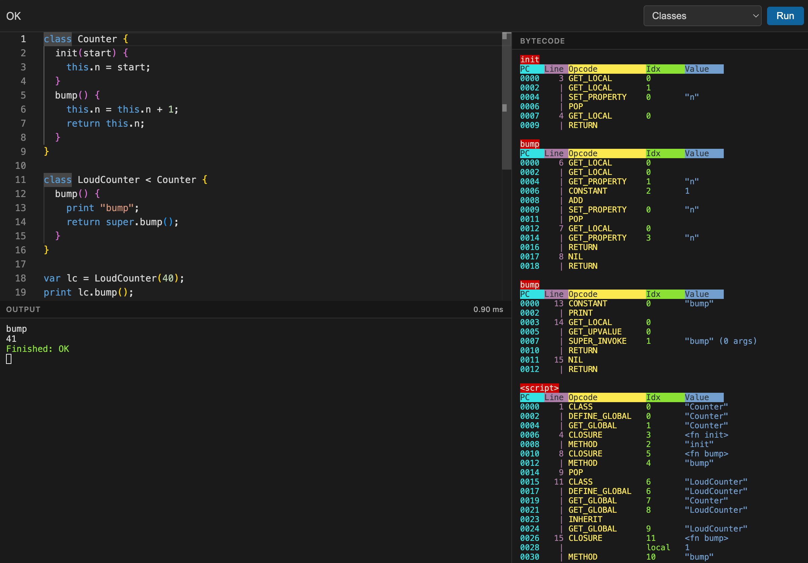

Bytecode VM based on the one in "Crafting Interpreters".

https://dawdmaow.github.io/odinlox/

*Features*
- Single-pass compiler (no AST)
- Stack-based
- Mark-and-sweep GC
- String interning

*Constructs*
- Variables
- Data types
- Operators
- Control flow
- Functions
- Closures
- Classes
- Inheritance
- Native functions

